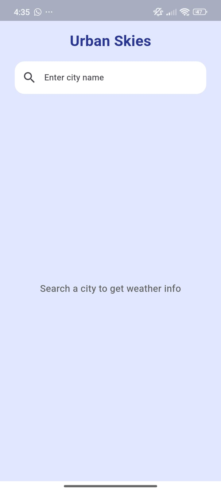
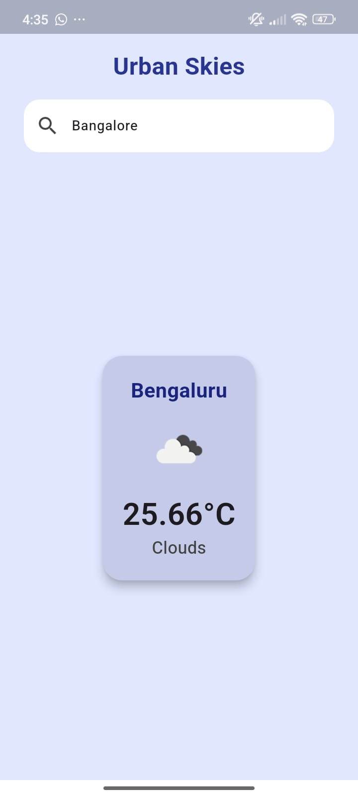

# 🌤️ Urban Skies

**Urban Skies** is a sleek and modern weather app built with Flutter. It provides real-time weather updates based on the user's city input and features a clean, user-friendly UI.

---

## 🚀 Features

- 🌐 City-based weather forecast
- 🎨 Elegant splash screen with animation
- ☁️ Weather icons & status
- 💾 Stores the last searched location
- ⚙️ Built with REST APIs using OpenWeatherMap
- 📱 Responsive design

---

## 📸 Screenshots

### Home Screen


### Weather Results


### City Not Found


## 🛠️ Tech Stack

- **Flutter** (Dart)
- **OpenWeatherMap API**
- **Shared Preferences**
- **Flutter Native Splash**
- **Flutter Spinkit**

---

## 🔧 Setup Instructions

```bash
git clone https://github.com/your-username/urban_skies.git
cd urban_skies
flutter pub get
flutter run
